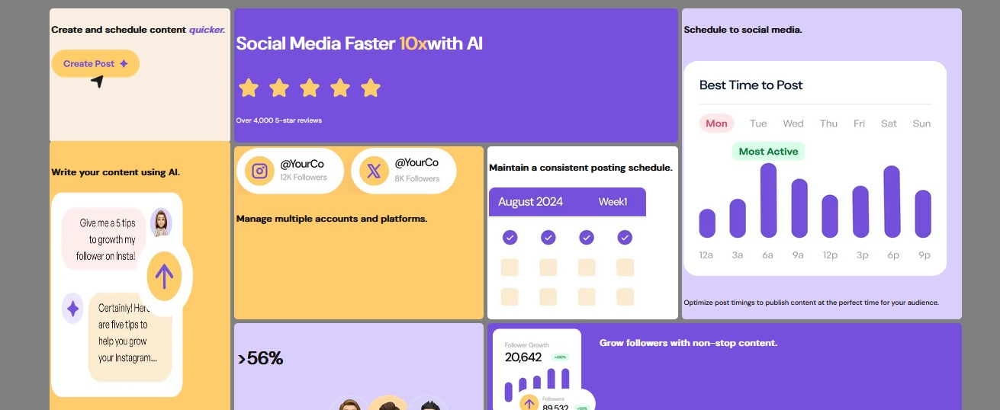
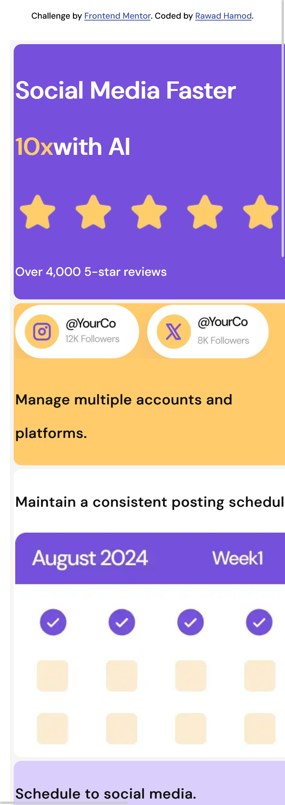

# Frontend Mentor - Bento grid solution

This is a solution to the [Bento grid challenge on Frontend Mentor](https://www.frontendmentor.io/challenges/bento-grid-RMydElrlOj).

## Table of contents

- [Overview](#overview)
  - [The challenge](#the-challenge)
  - [Screenshot](#screenshot)
  - [Links](#links)

  - [Built with](#built-with)
  - [What I learned](#what-i-learned)
  -
 

## Overview
It is my first challenge in frontend mentor, I had alot of new information while searching to implement the unusual grid layout.
I think the main concept is to break the roles and think out of the box that the html structure element order doesn't always represent the required layout suiting different devices.
### The challenge

Users should be able to:

- View the optimal layout for the interface depending on their device's screen size

### Screenshot

- Solution URL: [Add solution URL here](https://your-solution-url.com)
- Live Site URL: [Add live site URL here](https://your-live-site-url.com)

### Built with

- Semantic HTML5 markup
- CSS custom properties
- CSS Grid
- Mobile-first workflow

### What I learned

different types of css grid template layout

- Frontend Mentor - [@rawad-hamod](https://www.frontendmentor.io/profile/rawad-hamod)

